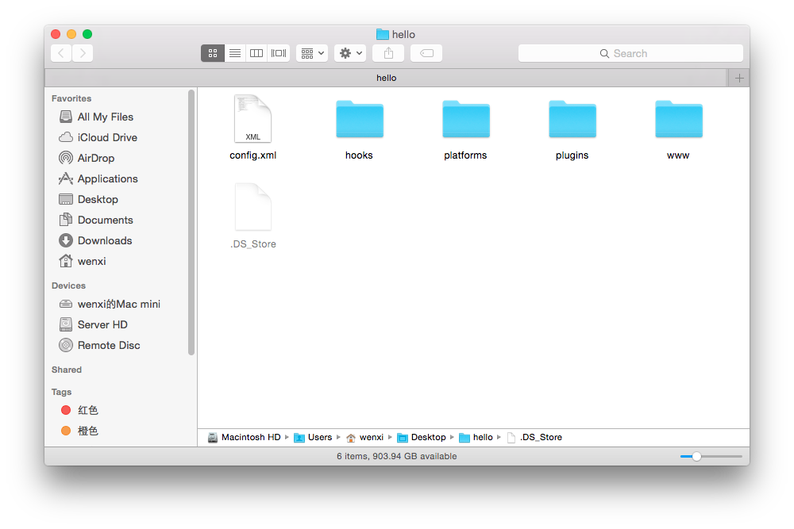
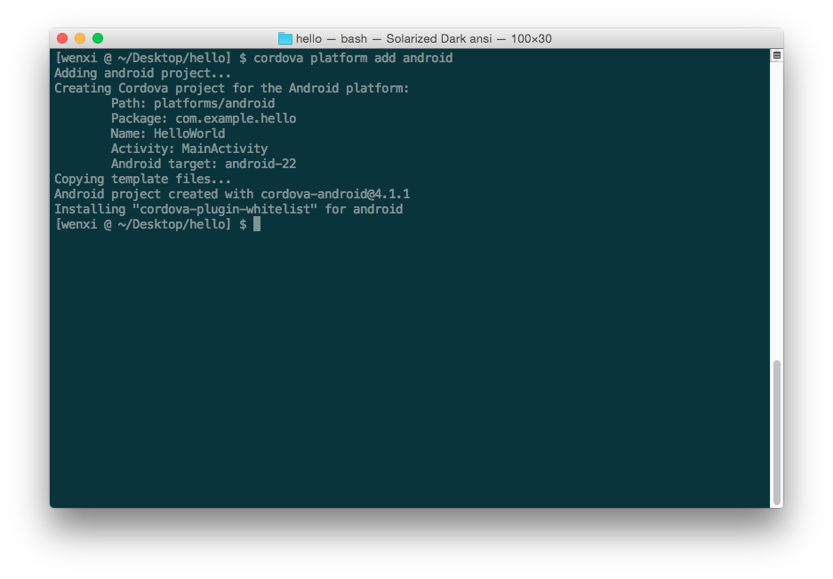
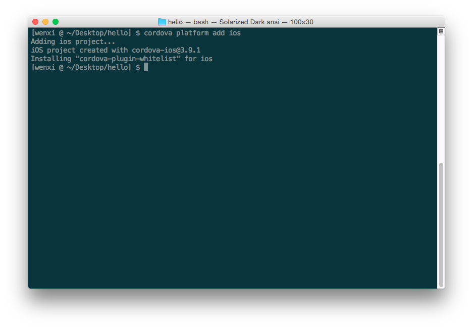
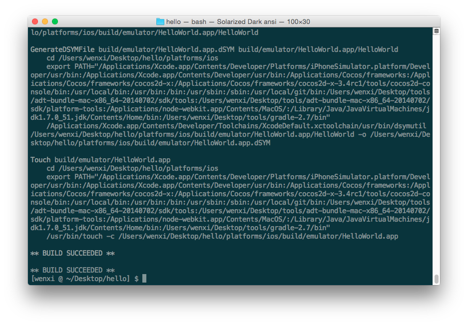
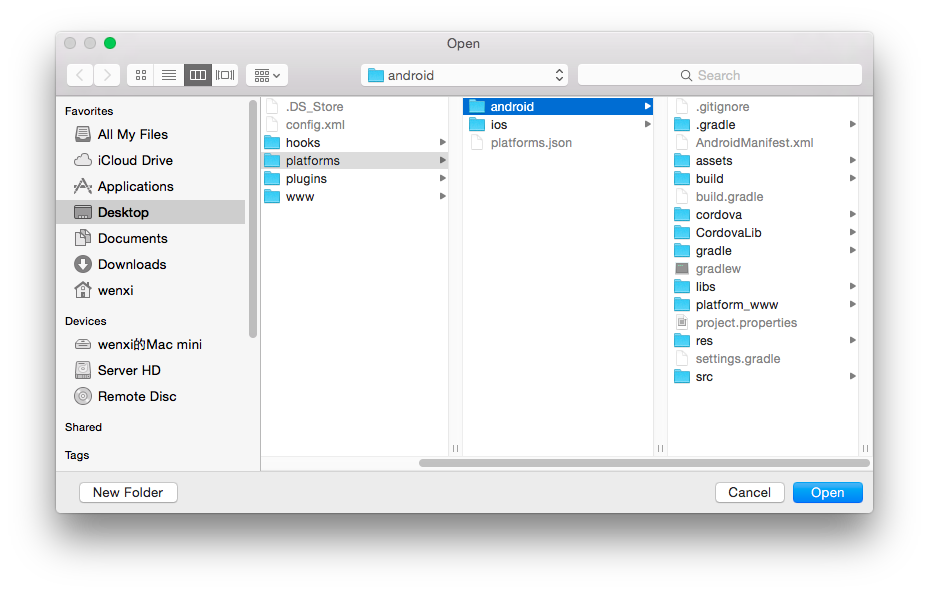
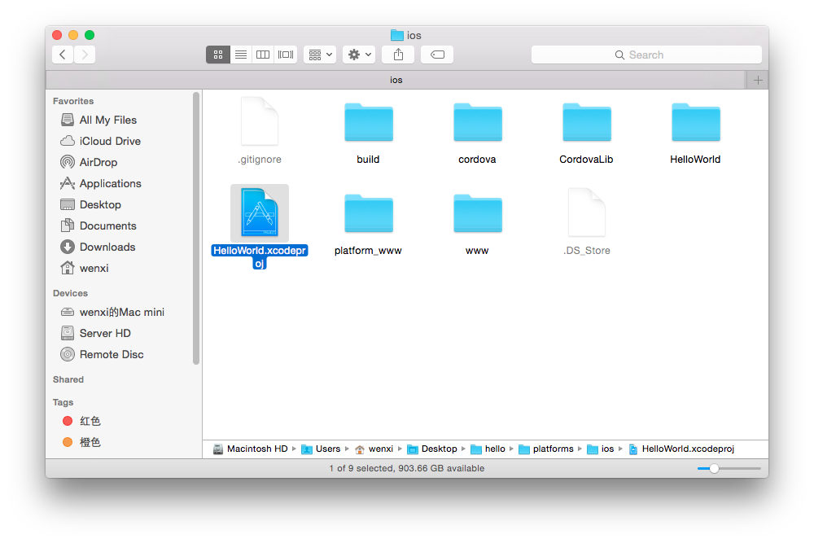

# 离线打包Intel® XDK项目

******

## 最近一些国内用户在使用Intel® XDK在线打包功能时遇到了一些困难，包括打包、下载安装包太慢，甚至打包失败。这是 <del>GFW</del> 一些不可抗力造成的，我们的建议是：使用代理服务，就可以解决这个问题。而对于不方便在开发环境中使用代理服务的用户，我们今天将介绍离线打包XDK工程的方法，让大家摆脱不稳定网络环境的困扰。

******

### 在离线打包之前，你需要预先安装：
1. [Node.js](https://nodejs.org/en/)；
2. Cordova CLI: <code>$ npm install -g cordova</code>;
3. plugman: <code>$ npm install -g plugman</code>;
4. 打包Android应用，请安装*Android SDK*；打包iOS应用，请安装*Xcode*。

### 步骤0. 使用XDK创建/编码/调试你的工程
在打包之前，编码并调试好你的XDK工程。因为中国网络环境的原因，XDK的在线打包服务不够稳定，但是XDK的其它功能，例如代码提示/模拟器/Live Development/真机调试/分析，还是一如既往的给力！关于这些功能，具体文档请参考：https://software.intel.com/zh-cn/intel-xdk/documentation。 请充分利用这些基础设施来开发并完善你的应用！确保它们在模拟器/真机调试中都工作正常，然后就可以进入下面的离线打包环节。

### 步骤1. 创建新的Cordova工程
我们将使用Cordova命令行来将XDK打包成各个平台的安装包（apk/ipa）。在这之前，我们需要先将XDK工程转换成一个Cordova工程。XDK工程的目录结构和一个典型的Cordova工程有显著区别，但是有一个很简单的办法将XDK工程转换成Cordova工程：

1. 创建一个空的Cordova工程；
2. 然后将XDK工程的源代码复制到Cordova工程中。

下面是具体操作。切换到工作目录，输入如下命令: 

<code>$ cordova create hello com.example.hello HelloWorld</code>

1. 第一个参数*hello*指定了在当前工作目录下创建一个hello文件夹，新建的Cordova工程将在这个目录下。
2. 第二个参数*com.example.hello*指定了应用的id。
3. 第三个参数*HelloWorld*指定了这个项目的名称。

成功运行该命令后，你的工作目录下会出现一个hello文件夹，里面有如下的目录结构：

### 步骤2. 替换www文件夹
XDK工程里的你编写的源代码都保存在WWW目录下，请用这个www文件夹替换hello工程根目录下的文件夹。

1. 删除*hello*目录下的*www*文件夹；
2. 复制Intel® XDK工程目录下的www文件夹，到*hello*文件夹下。

### 步骤3. 添加Android/iOS平台
1. 切换到hello目录下，请根据需要的平台，选择输入如下命令：

   <code>$ cordova platform add android</code> (添加Android平台)
   

   <code>$ cordova platform add ios</code> （添加iOS平台）
   
   
2. 输入如下命令，编译Android和iOS平台代码：
   <code>$ cordova build</code>
   
   
   
### 步骤4. 安装Cordova插件
使用plugman来安装插件：

1. 为Android应用添加插件：<code>$ plugman --platform android --project platforms/android --plugin <url/name/path-to-plugin/></code>
2. 为iOS应用添加插件：<code>$ plugman --platform ios --project platforms/ios --plugin <url/name/path-to-plugin/></code>

plugman相关文档详见：http://cordova.apache.org/docs/en/5.1.1/plugin_ref/plugman.html

### 步骤5. 编译出安装包
1. Android应用：将platforms/android目录导入eclipse中，编译出apk。

2. iOS应用：将platforms/ios目录下的.xcodeproj文件打开，在Xcode中编译出ipa。

