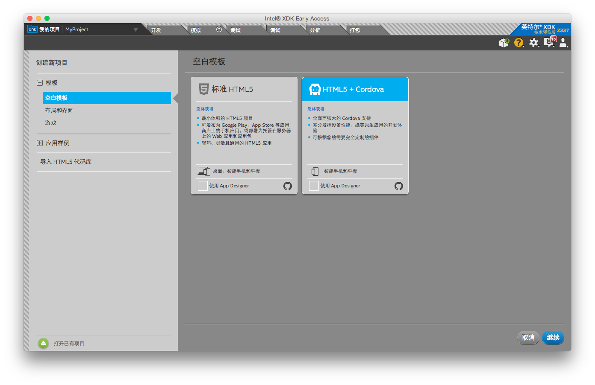
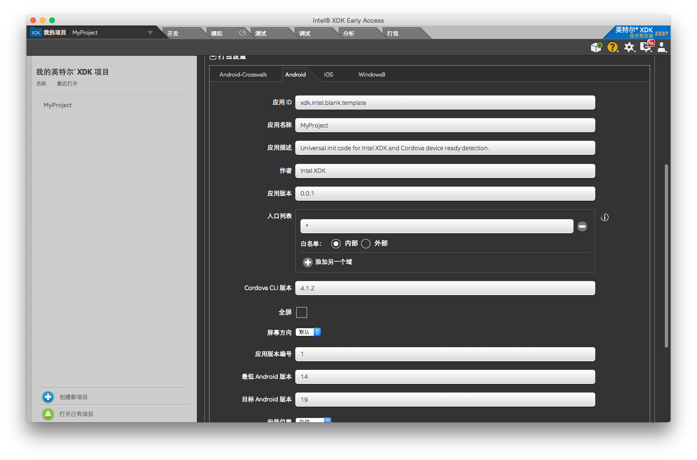
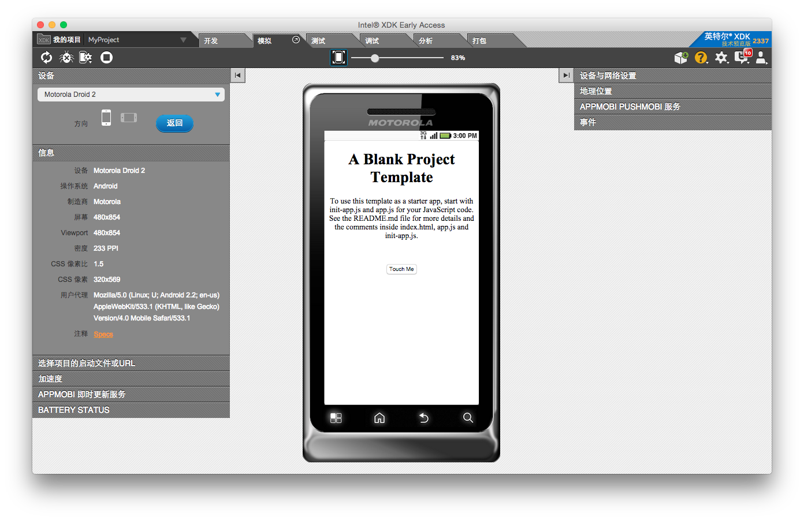
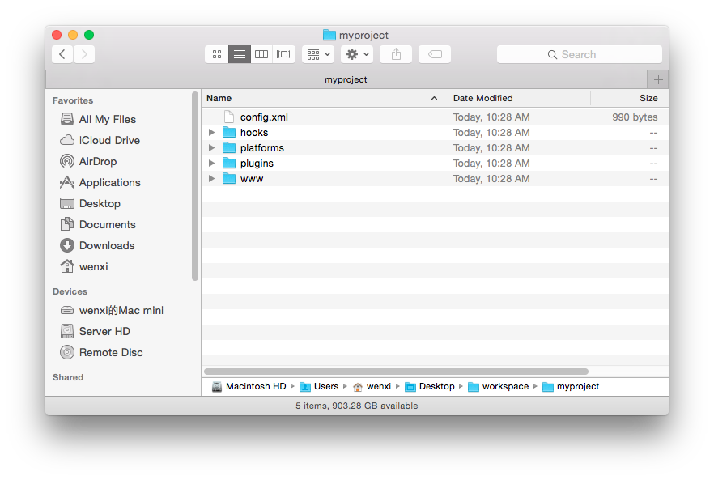
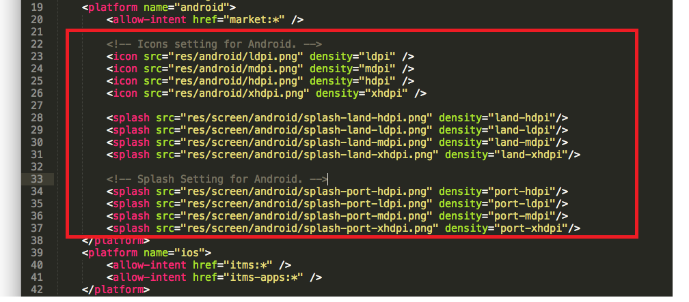
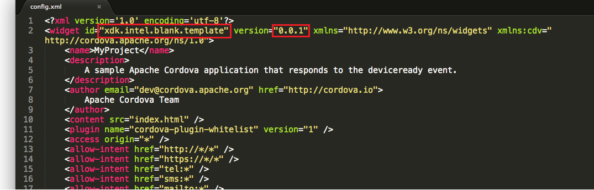
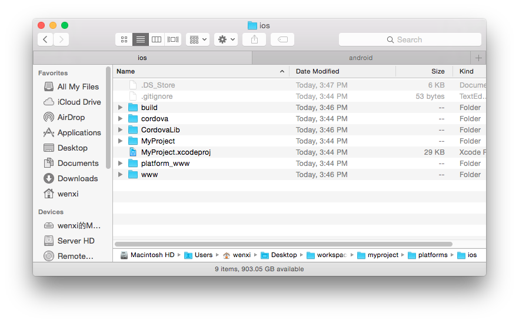

# 离线打包Intel® XDK项目

*近期一些国内用户在使用XDK在线打包功能时遇到了一些困难，包括打包、下载安装包太慢，甚至打包失败。这是 <del>GFW</del> 一些不可抗力造成的，我们的建议是：使用代理服务，就可以解决这个问题。而对于不方便在开发环境中使用代理服务的用户，我们今天将介绍离线打包XDK工程的方法，让大家摆脱不稳定网络环境的困扰。*

## 离线打包具体步骤:

### 在离线打包之前，你需要预先安装：
1. [Node.js](https://nodejs.org/en/)；
2. Cordova CLI: <code>$ npm install -g cordova</code>;
3. plugman: <code>$ npm install -g plugman</code>;
4. 打包Android应用，请安装*Android SDK*；打包iOS应用，请安装*Xcode*。

### 步骤0. 使用XDK创建/编码/调试你的工程
在打包之前，编码并调试好你的XDK工程。因为中国网络环境的原因，XDK的在线打包服务不够稳定，但是XDK的其它功能，例如代码提示/模拟器/Live Development/真机调试/分析，还是一如既往的给力！关于这些功能，具体文档请参考：https://software.intel.com/zh-cn/intel-xdk/documentation。 请充分利用这些基础设施来开发并完善你的应用！确保它们在模拟器/真机调试中都工作正常，然后就可以进入下面的离线打包环节。

### 步骤1. 创建一个空的Cordova工程
我们将使用Cordova命令行来将XDK打包成各个平台的安装包（apk/ipa）。在这之前，我们需要先将XDK工程转换成一个Cordova工程。XDK工程的目录结构和一个典型的Cordova工程有显著区别，但是有一个很简单的办法将XDK工程转换成Cordova工程：

*创建一个空的Cordova工程，然后将XDK工程的源代码、配置和插件迁移到Cordova工程中。*

下面是具体操作。切换到工作目录，输入如下命令: 

<code>$ cordova create hello com.example.hello HelloWorld</code>

1. 第一个参数*hello*指定了在当前工作目录下创建一个hello文件夹，新建的Cordova工程将在这个目录下。
2. 第二个参数*com.example.hello*指定了应用的id。
3. 第三个参数*HelloWorld*指定了这个项目的名称。

成功运行该命令后，你的工作目录下会出现一个hello文件夹。切换到这个hello工作目录下，添加Android/iOS子工程：

<code>$ cordova platform add android</code> (添加Android平台)

<code>$ cordova platform add ios</code> （添加iOS平台）

### 步骤2. 将XDK中的源代码迁移到Cordova工程中
XDK工程里的你编写的源代码都保存在WWW目录下，请用这个www文件夹替换hello工程根目录下的文件夹。

1. 删除*hello*目录下的*www*文件夹；
2. 复制XDK工程目录下的www文件夹，到*hello*文件夹下；
3. 在hello目录下运行下面的命令，编译出源代码：

   <code>$ cordova build</code>

   
### 步骤3. 应用配置的迁移
XDK提供了便捷的Cordova应用设置，包括*打包设置*和*应用图标/启动画面设置*，XDK在线打包系统会自动导入这些设置到安装包中。但是现在我们不得不使用离线打包，这些配置就必须使用繁琐的手动方法写入到Cordova工程里了。具体步骤详见后面的实例。
   
### 步骤4. Cordova插件的迁移
XDK提供了便捷的Cordova插件安装和配置功能，遗憾的是使用离线打包我们就无法享受这些便利的功能了。之前在XDK中加载过的的Cordova插件，必须都通过plugman命令行工具来手动来安装到当前的Cordova工程中。

使用plugman来安装插件：

1. 为Android应用添加插件：<code>$ plugman --platform android --project platforms/android --plugin <url/name/path-to-plugin/></code>
2. 为iOS应用添加插件：<code>$ plugman --platform ios --project platforms/ios --plugin <url/name/path-to-plugin/></code>

plugman相关文档详见：http://cordova.apache.org/docs/en/5.1.1/plugin_ref/plugman.html

### 步骤5. 编译出安装包
1. Android应用：将platforms/android目录导入eclipse中，编译出apk。
2. iOS应用：将platforms/ios目录下的.xcodeproj文件打开，在Xcode中编译出ipa。

## 一个离线打包XDK工程的实例
下面的章节，我们将通过一个图文实例来介绍离线打包XDK的具体流程。

### 步骤0. 创建并调试好XDK工程
1. 创建一个基于空白模板HTML5+Cordova的新工程:
   
2. 在配置界面配置一些项目,例如添加/删除插件，添加icon/splashscreen，指定应用ID/名称/版本。
   
3. 在模拟器重调试项目，确保应用界面布局和代码逻辑正确：
   
4. 真机调试，确保XDK应用在真机设备上也能正常工作：

### 步骤1. 创建空的Cordova工程
1. 切换到工作目录，输入如下命令：

	<code>$ cordova create myproject com.example.myproject MyProject</code>

	"Creating a new cordova project"意味着创建Cordova工程成功。现在，工作目录下会出现一个"myproject"目录，目录结构如下：
    

2. 切换到myproject目录下，添加Android/iOS工程：

	<code>$ cordova platform add android</code> (添加Android平台)

	<code>$ cordova platform add ios</code> （添加iOS平台）

### 步骤2. XDK源代码的迁移
1. 删除*hello*目录下的*www*文件夹；
2. 复制XDK工程目录下的www文件夹，到*hello*文件夹下；
3. 在hello目录下运行下面的命令，编译出源代码：

   <code>$ cordova build</code>

### 步骤3. 应用配置的迁移
1. 检查XDK工程配置界面里的打包设置：
   
2. 将XDK工程配置手动写入到Cordova工程下的config.xml目录里。这里的配置包括两部分：

   * Icon/Splashscreen
   
   	  Android和iOS平台对icon和splash的尺寸和种类要求是不同的。你需要对照XDK的“应用图标和启动画面”菜单，对应的在config.xml文件中的platform元素下加上icon和splashscreen子元素来配置这些属性。具体可以参照[Icons and Splash Screens](http://cordova.apache.org/docs/en/5.4.0/config_ref/images.html) 文档。
   	  
   	  
   	  
   * 打包配置
   
      XDK的“打包配置”也需要被迁移到config.xml里。例如Android配置中的“应用ID”为"xdk.intel.blank.template"，对应的就应该把config.xml中<widget>元素的id属性改为"xdk.intel.blank.template"; “应用版本”为"0.0.1"，对应的把config.xml中<widget>元素的version属性改为"0.0.1"。更多打包配置对应的config.xml设置请参考 [The config.xml File](http://cordova.apache.org/docs/en/5.4.0/config_ref/index.html) 。
      
	  
	
3. 运行<code>$ cordova build</code>，把config.xml的修改应用到Android/iOS工程里。

### 步骤4. Cordova插件的迁移
打开Cordova工程目录下的plugins文件夹，可以看到“org.apache.cordova.device”和“org.apache.cordova.splashscreen”这两个插件。使用plugman来安装这些插件到Cordova工程下：

* 安装Android平台插件：

<code>$ plugman --platform android --project platforms/android --plugin <local-path-to-org.apache.cordova.device/></code>

<code>$ plugman --platform android --project platforms/android --plugin <local-path-to-org.apache.cordova.splashscreen/></code>

* 安装iOS平台插件：

<code>$ plugman --platform ios --project platforms/android --plugin <local-path-to-org.apache.cordova.device/></code>

<code>$ plugman --platform ios --project platforms/android --plugin <local-path-to-org.apache.cordova.splashscreen/></code>

### 步骤5. 编译安装包
1. Android apk: 将myproject/platforms/android目录导入eclipse中，编译出apk。
   
2. iOS apk: 双击myproject/platforms/ios目录下的MyProject.xcodeproj文件，在Xcode中编译出ipa。
   